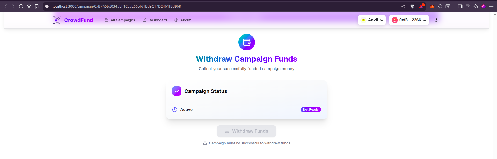
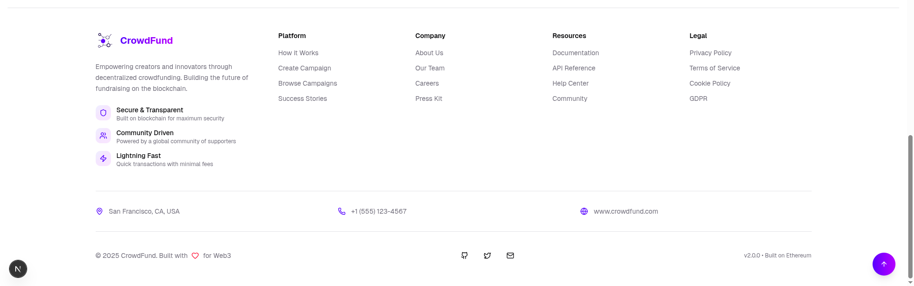

# 📸 CrowdFunding DApp Screenshots

**Visual Tour of the Complete DApp Interface** ✨

*Experience the beautiful UI/UX of our Web3 crowdfunding platform*

---

## 🏠 Homepage Experience

Discover campaigns and connect your wallet with our stunning homepage interface.

### 🌟 Hero Section

*Beautifull landing section*

---

### 🔗 Web3 Wallet Integration

*Seamless wallet connection with RainbowKit*

---

### 💰 Campaign Showcase

*Browse active campaigns with beautiful gradient cards*

---

## 📋 About Page Journey

Learn about our platform's mission and features through engaging content.

### 🎯 Platform Overview

*Comprehensive introduction to decentralized crowdfunding*

---

### ✨ Our Mission

*Empowering creators and supporting innovators through blockchain technology*

---

### 🛠️ Our Values

*Core principles that drive our decentralized crowdfunding platform*

---

### ✨ Platform Features

*Discover the powerful features that make our platform unique*

---

### 🚀 Our Team

*Meet the passionate team building the future of crowdfunding*

---

## 🎯 Campaign Management

Experience the full campaign lifecycle from creation to funding.

### 📊 Campaign Dashboard

*Comprehensive campaign details and statistics*

---

### 💎 Funding Tiers System

*Flexible tier-based funding with rewards*

---

### ⏸️ Pause and Extend deadlines

*Intuitive funding process with real-time updates*

---

### 💸 Transaction Management

*Secure transaction processing with Withdrawals*

---

## ✨ Footer Section

### 🌐 Platform Information & Links

*Complete footer with navigation, social links, and platform details*

---

## 🎨 **Design Highlights**

| **Feature** | **Description** |
|-------------|-----------------|
| 🎨 **Modern UI** | Beautiful gradient themes with blue-purple-pink color palette |
| 📱 **Responsive** | Perfect display across all devices and screen sizes |
| 🌙 **Dark/Light Mode** | Automatic theme switching based on system preferences |
| ⚡ **Smooth Animations** | 60fps animations and micro-interactions |
| 🔗 **Web3 Integration** | Seamless wallet connection and transaction management |
| 📊 **Real-time Updates** | Live campaign data and funding progress |
| 🎯 **Intuitive UX** | User-friendly interface with clear navigation |
| 🛡️ **Security First** | Secure transaction flows with confirmation dialogs |

---

## 🛠️ **Technologies Showcased**

- **Next.js 15** + **React 19**: Modern framework with concurrent features
- **TailwindCSS** + **ShadCN UI**: Beautiful, accessible component library
- **Wagmi** + **RainbowKit**: Cutting-edge Web3 integration
- **TypeScript**: Type-safe development environment
- **Gradient Design System**: Consistent visual language throughout

---

**🎉 Experience the Future of Decentralized Crowdfunding! 🎉**

*Built with ❤️ using the latest Web3 technologies*

